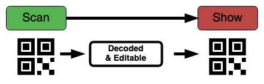
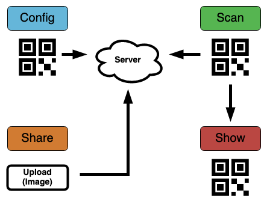

# qr-io

Minimal app for reproducing and sharing QR codes.

<https://pexmor.github.io/qr-io/> the app Git Pages hosted.

**TL;DR:** `python -mhttp.server -d docs 8088`

## Use cases

The app has two foreseen usages simple (without server) and
complex (with server).

### Simple

The elementary usecase is to just scan and show the QR for further scanning.



### Complex with Config

In this case it is expected that you have a server listening on some web URL and is using either **WebSocket** or plain **HTTP POST**.

> **Note:** such server is included in this repo and with help of [ngrok.com](https://ngrok.com/) you can run demo server right from your desktop. See instructions below [Receiving Server](#receiving-sever)



## How to configure

In case you want to configure the server you can create simple QR code containing simple JSON structure (Note: the single and double quotes matter).

### QREncode simple config

The following is a minimal self configured server url.

```bash
# create endpoint and show url
ngrok http 8080
# make config QR from that url
qrencode -t UTF-8 '{"mode":"auto-send","url":"https://<use-url-from-above>.ngrok.io"}'
```

### Receiving sever

The more complete example below is showing how to start **ngrok** with nodejs server and handle all the configuration within your browser.

```bash
# create endpoint and show url
ngrok http 8080
# install deps
yarn
# start server at port 8080 it will read the ngrok info automatically
yarn server
# open http://localhost:8080
# it will show config url (a json inside QR)
# read it by https://pexmor.github.io/qr-io/ -> button "config"
# after that every scanned QR is sent over to http://localhost:8080 page
```

## Sub licenses

This simple but usabe QR i/o project would not be possible without other libraries. These used in browser are listed below. There some other used by server to check those please have a look at [package.json](package.json).

| Part              | Link                                         | License                                                                        |
| ----------------- | -------------------------------------------- | ------------------------------------------------------------------------------ |
| PureCSS           | <http://purecss.io/>                         | [BSD](https://github.com/pure-css/pure/blob/master/LICENSE)                    |
| HTML5 QR Scanner  | <https://github.com/mebjas/html5-qrcode>     | [Apache-2.0](https://github.com/mebjas/html5-qrcode/blob/master/LICENSE)       |
| QR Code generator | <https://github.com/danielgjackson/qrcodejs> | [BSD-2-clause](https://github.com/danielgjackson/qrcodejs/blob/master/LICENSE) |

## Final notes

Ideas:

- [py/01_easyocr.py](py/01_easyocr.py) - OCR experiment on image postprocessing at the server
- <https://pexmor.github.io/qr-io/tesseract.html> - another OCR experiment, hosted in your browser
